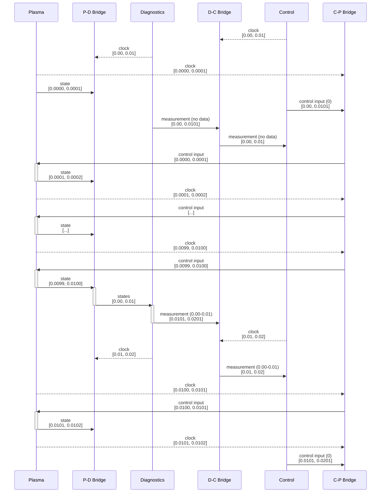

# Tokamak simulation with time bridges

This repository contains an example for how to co-evolve a physical system, diagnostics
or sensors that measure the state of that system, and controllers that steer the system
based on the measured values, using MUSCLE3.

The example used here is of height control in a tokamak fusion reactor, but the concept
transfers to other situations.

The model used here does not do any kind of physics (or any realistic measurement or
control), but it has all the communication patterns a real simulation has. The plasma
model uses variable timestepping in the way an implicit Euler integrator does, while the
diagnostics and controller are each on their own regular sampling cycle.

The diagnostic receives the plasma states covering each of its sampling intervals and
computes an average height, which, after a processing delay, is sent to the controller.
The controller then picks it up at its next control cycle, calculates control input
values for the near future, and those get sent to the plasma model where they provide
feedback and hopefully keep things stable.

## Set up

Clone this repository:

```bash

git clone https://github.com/LourensVeen/tokamak_time_bridge_example
cd tokamak_time_bridge_example
```

Install it into the local `opt/` subdirectory:

```bash
tokamak_time_bridge_example$ make
```

Next, activate the virtual environment and set the `YMMSL_PATH` environment variable
according to the instructions printed by the previous step.

## Running an uncontrolled simulation

The configuration file `plasma_only.ymmsl` has the following contents:

```yaml

ymmsl_version: v0.2

imports:
  - from ttb_example.reactor import implementation reactor
  - from ttb_example.programs.plasma import implementation plasma

custom_implementations:
  reactor.plasma: plasma

settings:
  muscle_remote_log_level: DEBUG
  muscle_local_log_level: DEBUG
```

This imports the tokamak reactor simulator, which provides the model's structure. It
describes connections between plasma, diagnostics, and controller, using three time
bridges to connect them pairwise so that the plasma state is sent to the diagnostics,
whose measurements are sent to the controller, whose control inputs are sent back to the
plasma model.

The `reactor` model does not have any default implementations for its six components, so
by default it does nothing. To run only the plasma model, we import that, and then plug
in into the `reactor.plasma` component. We also increase the log level to get some more
detailed output.

To run the simulation, we start it using MUSCLE3:

```bash
(venv) tokamak_time_bridge_example$ muscle_manager --start-all plasma_only.ymmsl
```

The simulation takes about a minute to run.

A record of the run will be written to the `muscle3_manager.log` file in the output
directory given by MUSCLE3 at the end of the run. A diagram of plasma height will show
on the screen as well. As you can see, things are not as stable as we'd like for them to
be.

## Running with diagnostics

To observe the plasma while it's evolving, we need to add some diagnostics. To do that
we can use the configuration file `plasma_diagnostics.ymmsl` with the following
contents:

```yaml

ymmsl_version: v0.2

description: |
  This runs the plasma model, diagnostics, and the time bridge between them

imports:
  - from ttb_example.reactor import implementation reactor
  - from ttb_example.programs.plasma import implementation plasma
  - from ttb_example.programs.bridge_plasma_diagnostics import implementation bridge_plasma_diagnostics
  - from ttb_example.programs.diagnostics import implementation diagnostics

custom_implementations:
  reactor.plasma: plasma
  reactor.bridge_plasma_diagnostics: bridge_plasma_diagnostics
  reactor.diagnostics: diagnostics

settings:
  muscle_remote_log_level: DEBUG
  muscle_local_log_level: DEBUG
```

This can then be run in the same way as above, and the results inspected. Of course just
measuring things doesn't change anything, so the plasma still crashes.

## Running with control

Finally, we can add the control component and two more time bridges, one in between
diagnostics and control, and one in between control and the plasma model. That
configuration is in `plasma_diagnostics_control.ymmsl` and can be run from there. As
you'll notice, the control system isn't very good, but then the controller is pretty
dumb. A better implementation is left as an exercise for the reader.

## Implementation

The simulation consists of six components: the plasma model, the diagnostics model, the
controller, and three *time bridges* in between each pair. All six components run
simultaneously, in parallel, and on their own timelines, exchanging information as
needed by sending messages. The source code for these can be found in `src/programs/`,
with one Python script and one yMMSL file describing it for each.

When `make` is run in the top-level directory, these Python scripts are copied to the
installation directory for binaries (`opt/bin' by default). The yMMSL files are copied
to `opt/ymmsl`, substituting the installation directory for the `PREFIX` string in them.

We can then point `YMMSL_PATH` to `opt/ymmsl` to tell MUSCLE3 everything it needs to
know about the installed programs. If the programs are installed in a different place on
a different machine, then we can still run the same simulations, we just have to set
`YMMSL_PATH` differently.

The overall structure of the model is defined in `src/ymmsl/ttb_example/reactor.ymmsl`,
which also gets installed into `opt/ymmsl`. This is an empty structure without
implementations, so the user finally creates a yMMSL file importing that structure plus
any desired implementations and settings that describes the scenario they want to run.

### Plasma model

The plasma model doesn't implement any tokamak physics. Instead, its state is a single
number representing the vertical position of the plasma inside the tokamak. Each state
update moves the plasma through a combination of a random walk, a spring with a negative
spring constant pushing it away from 0.0, and input from the control system.

Other than the plasma position being unstable in the vertical direction that's
rather unrealistic, but the point of this model is to demonstrate communication
patterns, not plasma control.

The time stepping for the plasma model is inspired by ETS-PAF, which evolves the plasma
using an implicit Euler solver which solves the next plasma equilibrium at a given dt,
and reduces the time step until the solver converges. The implementation here has a
variable time step too, to demonstrate how that works with the time bridges.

The plasma model sends its state prior to making every time step on `O_I`, with its
current time and a next timestamp assuming that the next timestep will be the maximum
size. It then receives control input on `S`, in the form of a curve (here as a list of
control points with linear interpolation, but other options are possible), which it
evaluates at the point it tries to step to.

The plasma model communicates at every time step. Another option would be for it to
communicate only every `dt_max`, and do however many micro-timesteps it needs to cover
`dt_max` of time before communicating again. Either way will work with this setup.

### Diagnostics model

The diagnostics model runs on a fixed measurement interval that constantly repeats. It
receives plasma data for the current interval, processes it (which takes time), then
sends an averaged value with some noise as the height measurement.

The diagnostics model starts each iteration by sending the current measurement interval
on `O_I` on a special `clock_out` port, with no data attached. This information is used
by the bridge between plasma and diagnostics to know which data the diagnostics model
needs. Since each component in a MUSCLE3 simulation is free to timestep in any way it
likes, there would otherwise be no way for the bridge to know which data it needs to
supply when.

It then sends out the measurement data that it obtained on the previous iteration.
Note that the first actual measurement is sent at the start of the second interval,
after the plasma data are available. To cover the start of the simulation, the code
sends an empty message (containing `None`), which the bridge will interpret as "no
data".

With `O_I` done, the diagnostics model moves on to `S`, in which it receives plasma data
covering the current window. It calculates an average height from this, with some noise
because no measurement is perfect, and stores it together with a timestamp in the middle
of the window for sending on the next iteration.

At the end of the run, there is a final measurement that does not get sent on `O_I`
because there is no next iteration, but it could be sent on an `O_F` port to help
initialise a subsequent phase of the simulation, if needed.

The current diagnostics model does not save any state or data in between iterations, but
it certainly could, for example to calculate a running average over multiple measurement
windows.

### Plasma-Diagnostics Bridge

The time bridge between plasma and diagnostics communicates with both those components,
each on their own timeline, shuttling data from plasma to diagnostics while ensuring the
number of messages sent and received on each side matches what the peers do. Since both
sides start each time step by sending data on `O_I`, the bridge needs to start by
receiving on `S`. To enable that, the MMSF checks are disabled. (From MUSCLE3 0.11 the
new timelines feature, which extends the MMSF theory to allow this, will be used while
keeping the checks enabled.)

The bridge starts each iteration by receiving the clock signal from the diagnostics
side, which tells it what data the diagnostics component needs next. It then receives
plasma data from the plasma model until it has collected every plasma state within that
time window (but not beyond it), and finally sends it to the diagnostics model, then
repeats. It attaches the timestamp on each plasma observation to the corresponding data,
so that the diagnostic receives a list of (timestamp, height) pairs.

Note that the plasma model has smaller time steps than the diagnostic, but that the
coupling will work if it's the other way around as well. The diagnostic will likely
produce a lot of identical values in that case, unless it does some kind of smooth
extrapolation.

### Control

The control component is similar to the diagnostics model. It sends its next input
interval on a `clock_out` port, control input for the plasma model from the previous
iteration on `control_out`, then receives measurements within the current [t_cur,
t_next] interval. Unlike the diagnostics model, it uses the most recent measurement,
rather than an average. This is an arbitrary choice, the model can use the received data
in any way it likes.

The control model then uses the input to calculate a response, and creates a control
input for the plasma model that covers the time until the next time it will provide one.
The current implementation assumes that the control input does not change
instantaneously, but that it will change from the current value to the new value at the
end of the interval, but any kind of curve can be created. In a real system, such
gradual responses may be the result of actuators moving with finite acceleration or
magnetic fields changing gradually due to inductance.

This control input is then sent to the plasma model on the next iteration, again with a
slightly delayed time to account for processing, after sending another clock signal and
before taking the next control decision.

### Diagnostics-Control Bridge

The bridge between diagnostics and control is virtually identical to the one between
plasma and diagnostics. One difference is that the diagnostics input it receives already
has a timestamp describing at which point in time it was measured, separately from the
MUSCLE3 timestamp which signals when that measurement arrived at the control component,
so we're not adding that here.

The diagnostics-control bridge also knows how to deal with empty input messages, which
the diagnostics model sends at the beginning of the run to cover the first bit of the
timeline during which the first measurement is still in progress.

### Control-Plasma Bridge

The bridge between the controller and the plasma model is again similar. Of the data
points with control input sent by the controller, it sends the last one before plasma's
`t_cur`, and everything up to the first control point after `t_cur + dt_max`, to ensure
that the plasma model always has something to interpolate.

### Discussion

At first glance, it may seem like this simulation can't run. After all, the plasma model
needs input from the control system, which needs input from the diagnostics, which needs
input from the plasma model. As a result, the simulation should freeze (deadlock)
immediately.

However, this circular dependency isn't actually a circle, it's a helix. The plasma
model does respond to control inputs, but those controls are based on measurements taken
from the past of the plasma model. The measurements reach the control system, which then
creates control inputs *for the future*. The plasma model can then simulate that future
using those control inputs, while the diagnostics measure it and provide input to the
control system, which can add a bit more future onto the new present.



With the default settings, the diagnostics and control both run with a timestep of 0.01.
As a result, the first diagnostics measurement is made using plasma data between 0.0 and
0.01. It then takes 0.0001 to process the data, so that the measurement is available at
0.0101.

The control system has its first decision point at 0.0, where it will decide on control
output for 0.0001 (it also needs 0.0001 to think) to 0.0101 (when it will have decided
again based on new data). At 0.0 there's no data yet, so it does nothing. At 0.01, it
tries again, but there is still no data because the data covering 0.0 to 0.01 is still
being processed by the diagnostics. It only arrives at 0.0101, which is too late. It's
only at the next decision point at 0.02 that that first measurement will be used.

It will then start to influence the plasma at 0.0201, but actuators are slow and so the
full effect won't be active until 0.0301, at which point more data has come in, the
controller has made another decision, and the plasma responds to that.

All this is of course quite a realistic representation of a real-world system. If we
wanted to make it a bit more realistic by simulating a data network between the
diagnostic and the controller, then we can do so by adding one more component between
the diagnostics and the diagnostics-controller bridge. That component simply receives a
message containing a measurement, and sends it on unchanged but with its timestamps
increased by the network latency. The time bridge will then automatically move the
message beyond the next control decision point if the delay pushed its arrival time
beyond that.

